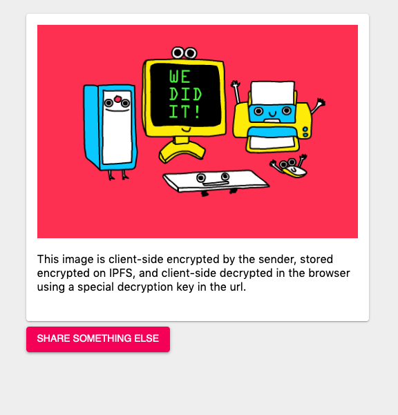

# TRES is Recursive Encrypted Sharing

This is a rough proof-of-concept idea that I had over a weekend. There are probably issues with it, but it should be fun to hack on.

The idea, from a user perspective, is to have an easy-to-use browser tool that you can send encrypted images to friends by dragging and dropping an image and having it generate a magic link that contains the decryption key.

You can see (and test out) a [working example here](https://ipfs.infura.io/ipfs/QmZv3Hzu3fEJ1pxMEeogjtApAkHzPGwPUxhF1yjMfEezoH?k=cfTdNhVyPo2zPAqDCyaqSVLtY8svDYLWmaOlNSeihhw=)

Under the hood, this is using IPFS, react, and [tweetnacl.js's implementation of secretbox](https://tweetnacl.js.org/#/). Everything is stored inline in a single html file. This includes the encrypted blob for the image and all of the js and styling. When a share is created, it sends a request to an IPFS RPC endpoint with a newly constructed single html file with everything inline. I know. old school. But this gives us zero outside dependencies with static file storage on IPFS. So. Fun? Cool?

IMPORTANT NOTES:
First, don't use this for anything serious. Please. This hasn't been vetted.

And, if you use the default public IPFS node, the decryption key is now a secret between you, the person you are sharing it to, and INFURA's server logs. This is true because of how the query param works. If you want to keep the secret, well... secret, spin up a local IPFS node and query against that. I have an idea for encrypted the key with an argon2 based passphrase, but I did't want to get caught up in that over a weekend hack. You've been warned.